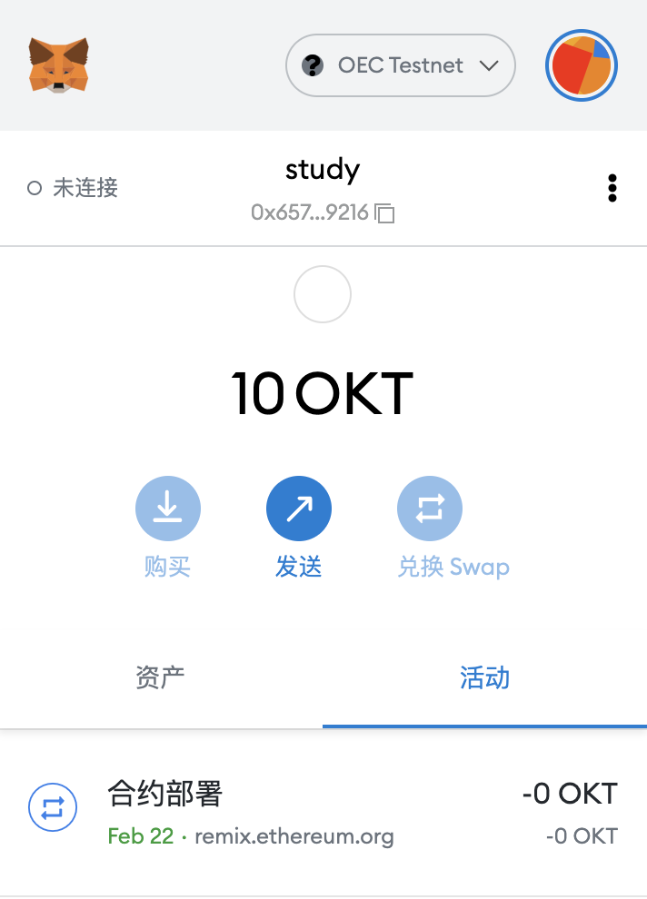
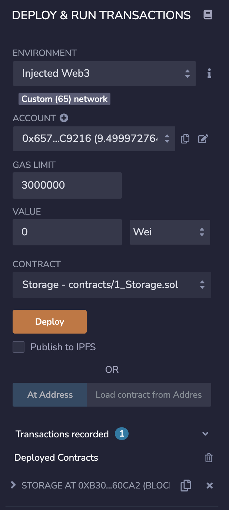

### 安装 MetaMask，并创建账号。
安装的扩展如图所示： 

通过 https://chainlist.org/ 网站，增加了 OK 测试链，并在水龙头获取测试币（OKT）。

### 执行一次转账
转账交易hash如下：
https://www.oklink.com/zh-cn/oec-test/tx/0x92b2a84b88bfe793490098ae2a351156d7462fe07436d43d2d74425bc02ffa91

### 使用 Remix 创建任意一个合约
部署示例图如下： 

合约创建的hash地址如下：
https://www.oklink.com/zh-cn/oec-test/tx/0x2714a406a21d9dee4f564b94defbc86c79c54f20bb79e9b44770f7890e337f20

